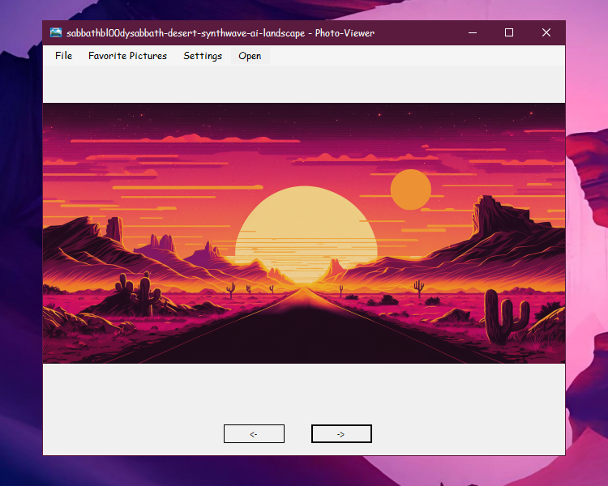

# 🖼️ Photo-Viewer

**Photo-Viewer** is a customizable image viewer that supports all major formats, including JPG, GIF, PNG, BMP, and more.

---

## ⚙ Technical Information
- This project is written in **C++/CLI**
---

## ✨ Features

- 💾 Saves and loads all user settings

- 📋 Clipboard integration:
  - Copy the currently displayed image to the clipboard
  - Copy the image file name to the clipboard

- 🖥 OS-level functionality:
  - Open the folder containing the current image
  - Open any image from the file system
  - Switch the application to fullscreen mode

- 🎨 Customization options:
  - Toggle between dark and light themes
  - Change the application font

- ❤️ Favorites list support:
  - Save images to a "Favorites" list
  - Remove images from the list
  - Switch between viewing all and favorite images

- 📽 Slideshow mode:
  - Adjustable interval between image changes

---

## 📁 Project Status
✅ Completed
